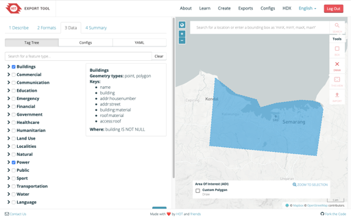

# Export Tool

The **Export Tool** is a web service that generates exports of OpenStreetMap (OSM) data for use in Geographic Information System (GIS) programs and mobile devices. The tool allows users to define an area of interest using a polygon and select OSM tags to include in the export. The tool then generates tabular files in various formats, such as CSV or GeoJSON, containing the OSM data within the specified area and tags.

One of the most important features of the Export Tool is its synchronization with the main OSM database. The tool is updated minutely, which means that it reflects changes made to the OSM database in near-real time. This makes the Export Tool a valuable resource for humanitarian mapping efforts that require up-to-date OSM data.

In addition to creating GIS files, the Export Tool also includes features such as periodic exports for humanitarian organizations and email notifications for when exports are complete. The tool also includes a user-friendly interface with error reporting and geometry drawing/uploading, built on OpenLayers.

# Get involved!

This is the source code for the web service available at [export.hotosm.org](https://export.hotosm.org). If you would like to export OSM data offline without using the website, you can access the separate command line tool and Python Library. This repository is at [github.com/osm-export-tool-python](https://github.com/hotosm/osm-export-tool-python). 

# Product Roadmap
We have included below a reference to the HOT Export Tool Product Roadmap [subject to change]. We hope it is a useful reference for anyone wanting to get involved.

## How to Contribute

* To report a problem or bug, please include a link to the export's download page. This will be a URL that looks like this: [export.hotosm.org/en/v3/exports/cb709d41-6f78-4ee5-8e9a-9eae7b63177c](https://export.hotosm.org/en/v3/exports/cb709d41-6f78-4ee5-8e9a-9eae7b63177c)
* Include the GIS program you are using and the version: for example, QGIS 3.8.
* Screenshots of the web interface or the data within your GIS program are always helpful!
* See detailed contributor guidelines [here](https://github.com/hotosm/osm-export-tool/blob/master/CONTRIBUTING.md).

## For Developers

The code in this repository powers the export tool web service and includes a number of features besides creating GIS files:

* Periodic exports for HOT's partner humanitarian organizations, such as those that appear on the [Humanitarian Data Exchange](https://data.humdata.org) platform.
* Authentication via OSM accounts and email notifications for when exports are complete.
* Storage of YAML feature tag selections.
* A rich user interface with error reporting and geometry drawing/uploading, built on OpenLayers.

If you would like to host the Export Tool yourself, see the `ops` folder, which includes instructions for setting up both an Overpass Instance and the Export tool web app on Ubuntu. 

If you would like to enhance the code of the Export Tool web app, a guide to installing it in a local development environment is at [docs/setup-development.md](docs/setup-development.md).
